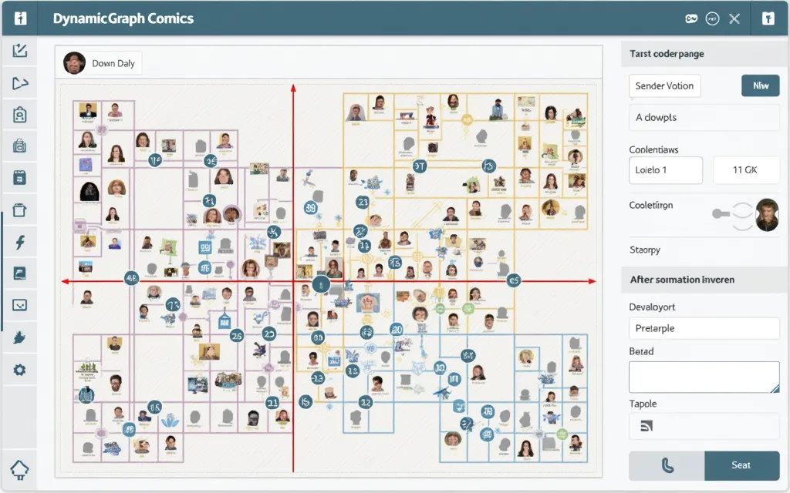
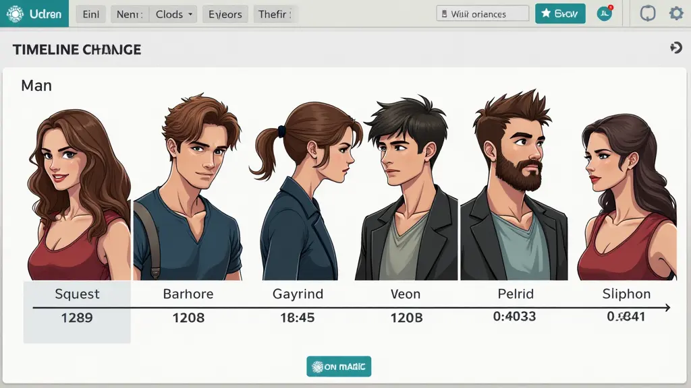

* * *

DynamicGraphComics
==================

简介 | Introduction
-----------------

DynamicGraphComics 是一个用于半自动创建动态图关系数据漫画的工具。该工具旨在通过漫画形式有效地展示动态图数据，解决手动创建此类数据展示过程中的耗时、复杂和易出错问题。

DynamicGraphComics is a tool for semi-automatically creating graph comics for dynamic graphs. The tool aims to effectively present dynamic graph data in comic form, addressing the time-consuming, complex, and error-prone nature of manual creation.

功能特点 | Features
---------------

### 自动聚类 | Automatic Clustering

*   使用因果保留的层次聚类算法，将时间事件聚类成段落，生成漫画模板。
*   Uses a causality-preserving hierarchical clustering algorithm to segment temporal events into paragraphs and generate comic templates.

### 图形和文本生成 | Graph and Text Generation

*   每个漫画面板展示主要角色的显著变化和关系，并使用模板生成的图形和说明文字。
*   Each comic panel shows significant changes and relationships of main characters, generating graphics and captions using templates.

### 可视化编辑 | Visual Editing

*   用户可以通过交互界面编辑漫画模板，增删文本框、图标，并调整节点和链接的样式。
*   Users can edit comic templates through an interactive interface, adding or removing text boxes, icons, and adjusting the styles of nodes and links.

### 角色和社交关系管理 | Character and Relationship Management

*   帮助用户选择和展示主要角色及其关系的变化，以及社交关系的演变。
*   Helps users select and display main characters and their relationship changes, as well as community evolution.

### 时间变化展示 | Temporal Change Display

*   支持用户检测和展示动态图的时间变化，并提供适当注释。
*   Supports users in detecting and displaying temporal changes in dynamic graphs with appropriate annotations.

示例 | Example
------------

以下是一个使用DynamicGraphComics工具创建的漫画示例：  
Here is an example of a comic created using the DynamicGraphComics tool:

项目路线图 / Project Roadmap
---------------

### 1. 数据转换 / Data Transformation

将数据转化为按时间线聚类的新数据格式。
Transform the data into a new format clustered by timeline.

### 2. 故事板排布 / Storyboard Arrangement

将时间线数据排布到故事板上。
Arrange the timeline data on the storyboard.

### 3. 编辑器定制 / Editor Customization

找一个开源的故事板编辑器并进行定制修改。
Find an open-source storyboard editor and customize it.

### 4. 功能增强 / Feature Enhancement

确保故事板支持可视化图表和子元素的编辑与添加功能。
Ensure the storyboard supports visual charts and the editing/adding of sub-elements.

参考资料 | References
---------------

[DG Comics: Semi-Automatically Authoring Graph Comics for Dynamic Graphs](https://arxiv.org/html/2408.04874v1)

许可证 | License
-------------

本项目采用 MIT 许可证。  
This project is licensed under the MIT License.

* * *
