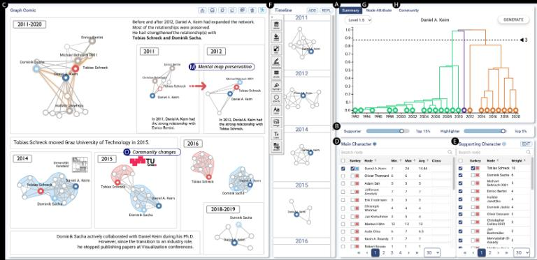

* * *

DynamicGraphComics
==================

简介 | Introduction
-----------------

DynamicGraphComics 是一个用于半自动创建动态图关系数据漫画的工具。该工具旨在通过漫画形式有效地展示动态图数据，解决手动创建此类数据展示过程中的耗时、复杂和易出错问题。

DynamicGraphComics is a tool for semi-automatically creating graph comics for dynamic graphs. The tool aims to effectively present dynamic graph data in comic form, addressing the time-consuming, complex, and error-prone nature of manual creation.

功能特点 | Features
---------------

### 自动聚类 | Automatic Clustering

*   使用因果保留的层次聚类算法，将时间事件聚类成段落，生成漫画模板。
*   Uses a causality-preserving hierarchical clustering algorithm to segment temporal events into paragraphs and generate comic templates.

### 图形和文本生成 | Graph and Text Generation

*   每个漫画面板展示主要角色的显著变化和关系，并使用模板生成的图形和说明文字。
*   Each comic panel shows significant changes and relationships of main characters, generating graphics and captions using templates.

### 可视化编辑 | Visual Editing

*   用户可以通过交互界面编辑漫画模板，增删文本框、图标，并调整节点和链接的样式。
*   Users can edit comic templates through an interactive interface, adding or removing text boxes, icons, and adjusting the styles of nodes and links.

### 角色和社交关系管理 | Character and Relationship Management

*   帮助用户选择和展示主要角色及其关系的变化，以及社交关系的演变。
*   Helps users select and display main characters and their relationship changes, as well as community evolution.

### 时间变化展示 | Temporal Change Display

*   支持用户检测和展示动态图的时间变化，并提供适当注释。
*   Supports users in detecting and displaying temporal changes in dynamic graphs with appropriate annotations.

使用流程 | Usage Process
--------------------

### 选择故事情节 | Choose a Storyline

*   帮助用户选择和展示主要角色及其关系的变化。
*   Helps users select and display the changes of main characters and their relationships.

### 时间变化展示 | Temporal Change Display

*   支持用户检测和展示动态图的时间变化，并提供适当注释。
*   Supports users in detecting and displaying temporal changes in dynamic graphs with appropriate annotations.

### 漫画创作 | Comic Creation

*   提供漫画创作机制，帮助用户遵循漫画的惯例。
*   Provides a comic creation mechanism, helping users follow comic conventions.

界面设计特点 | Interface Design Features
----------------------------------

### 多视图布局 | Multi-View Layout

*   左侧的“Graph Comic”视图展示了漫画面板，中间的“Timeline”视图展示了时间轴，右侧的“Summary”、“Node Attribute”和“Community”视图提供了数据的摘要、节点属性和社区变化的详细信息。
*   The left "Graph Comic" view shows comic panels, the middle "Timeline" view shows the time axis, and the right "Summary," "Node Attribute," and "Community" views provide data summaries, node attributes, and detailed community changes.

### 交互性 | Interactivity

*   用户可以通过点击和拖拽来调整时间轴和漫画面板，提供生成按钮（Generate），用户可以根据设定的参数生成新的漫画面板。
*   Users can adjust the timeline and comic panels by clicking and dragging, and a generate button (Generate) allows users to create new comic panels based on set parameters.

### 层次聚类和可视化 | Hierarchical Clustering and Visualization

*   右上角的图表展示了层次聚类的结果，用户可以通过调整层次滑块（Level Slider）来选择聚类的粒度。
*   The upper right chart shows the results of hierarchical clustering, and users can select the clustering granularity by adjusting the level slider.

### 角色管理 | Character Management

*   右侧视图中的“Main Character”和“Supporting Character”表格列出了主要和辅助角色，用户可以选择、排序和搜索角色。
*   The "Main Character" and "Supporting Character" tables in the right view list the main and supporting characters, allowing users to select, sort, and search characters.

### 社区变化可视化 | Community Change Visualization

*   社区视图（Community View）展示了不同角色在社区中的变化情况，使用颜色和路径来表示社区的演变。
*   The Community View shows the changes of different characters in the community, using colors and paths to represent community evolution.

### 详细信息和注释 | Detailed Information and Annotations

*   每个漫画面板中都包含详细的注释，帮助用户理解数据的变化和故事情节。
*   Each comic panel contains detailed annotations to help users understand data changes and the storyline.

示例 | Example
------------

以下是一个使用DynamicGraphComics工具创建的漫画示例：  
Here is an example of a comic created using the DynamicGraphComics tool:

参考资料 | References
---------------

[DG Comics: Semi-Automatically Authoring Graph Comics for Dynamic Graphs](https://arxiv.org/html/2408.04874v1)

许可证 | License
-------------

本项目采用 MIT 许可证。  
This project is licensed under the MIT License.

* * *
